# Mitron Bank: Analysis for New Credit Card Launch
## Created by Yawen Cao [LinkedIn Profile](https://www.linkedin.com/in/yawen-cao-306975337/)
### Live Dashboard at Tableau Public [Live_link_Tableau_Public](https://public.tableau.com/views/BankData_dashboard/DemographicAnalysis?:language=en-US&:sid=&:redirect=auth&:display_count=n&:origin=viz_share_link)

#
## Table of Content
1. [About Mitron Bank](#about-mitron-bank)
2. [Objective of the Project](#objective-of-the-project)
3. [Problem Statement](#problem-statement)
4. [Demographic Classification](#demographic-classification)
5. [Income Utilization & Spending Analysis](#income-utilization--spending-analysis)
7. [Recommendation](#recommendation-for-next-credit-card)

#
### About Mitron Bank 
Mitron Bank is a legacy financial institution headquartered in Hyderabad. They want to introduce a new line of credit cards, aiming to broaden its product offerings and reach in the financial market.

### Objective of the Project 
This project serves as a pilot for Mitron Bank’s credit card expansion. It analyzes the provided sample data and delivers actionable insights to the strategy team, helping them tailor credit card offerings to customer needs and market trends to increase market share.

### Problem Statement   

 * **Demographic classification:** Segment customers based on demographic attributes such as age group, gender, occupation, and city to uncover meaningful patterns in their financial behavior.
   
 * **Avg income utilisation %:** Calculate the average income utilization percentage (avg_spends / avg_income), a key metric indicating the likelihood of credit card usage—higher utilization suggests a greater propensity to adopt and use credit cards.
   
 * **Spending Insights:** Analyze where customers spend the most and examine how spending varies across demographics (occupation, gender, city, age). These insights can inform targeted offers, such as specialized rewards for specific purchase categories or demographic groups.

 * **Key Customer Segments:** Identify and profile high-value customer segments most likely to adopt the new credit cards by exploring their demographic characteristics, spending habits, and financial preferences.

 * **Credit Card Feature Recommendations:** Recommend key credit card features that would increase customer adoption and usage, based on observed behaviors and segment-specific needs.
#

## Demographic Classification:   
For demographic classification, a thorough customer demographic analysis was conducted using Tableau. Key findings are presented below in a visually engaging manner:

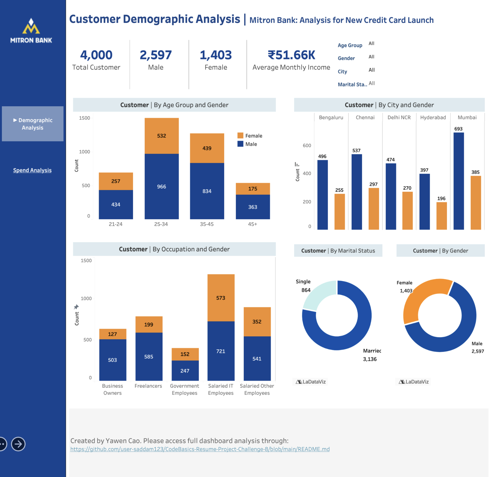

### Total Customers:

* The dataset includes a sample of 4,000 customers, which serves as the solid foundation of our analysis.

### Gender Segmentation:

* The 4,000 customers include 2,597 males (64.93%) and 1,403 females (35.08%), indicating a slightly male-dominated demographic. 

### Age Group Profiling: 

* **Primary Target Segment:** The 25–34 age group emerges as our largest and most significant customer segment, with 1,948 customers. This group, especially males, exhibits a strong presence (73.3%). The strategy team should prioritize developing and marketing cards with features that appeal to young and mid-career male professionals (e.g., rewards on tech, dining, travel, or fitness). 

* **Secondary Target Group:** The 35–45 age group is another key demographic, comprising 1,273 individuals. This demographic is likely entering peak earning years, making it ideal for premium cards, balance transfer offers, or family-oriented benefits (e.g., enhanced travel insurance, educational expense tracking). 

* **Balanced Niche Segment:** Customers aged 21–24 and 45+ are smaller segments but exhibit a relatively balanced gender distribution. This presents an opportunity for niche, university-oriented products. For the younger group, consider starter cards with credit-building features. For the 45+ group, focus on security, legacy benefits, and retirement lifestyle perks. 

### City-wise distribution:

* **Core Market (Mumbai):** Our leading hub with 1,078 customers, showing a pronounced male skew. 

* **Secondary Hubs (Chennai, Bangalore, Delhi NCR):** Significant contributors to our customer base, each also demonstrating a male-skewed demographic. 

### Occupation Insight:

 * Salaried IT Employees represent the largest portion of our customer base (1,294 customers). This tech-centric segment skews male (+148), confirming a strong initial foothold in this high-income demographic. They are our prime audience for aggressive cross-selling of premium cards with tech-focused perks, travel benefits, and partner offers. 
 
 * The diversity in occupations, including freelancers and business owners, presents an opportunity to tailor services for varied professional needs, such as unique cash flow and expense management requirements. 

 ### Marital Status Summary:
 

* **Dominant Segment – Married Customers:** The vast majority of our base is married (3,136 | 78.4%), underscoring a core demand for family-oriented financial products and joint account features.

* **Growth Opportunity – Single Customers:** The substantial single segment presents a clear opportunity to capture new market share by designing convenient, lifestyle-focused rewards tailored to individual spending habits.
 
## Income Utilization & Spend Analysis 
To understand customer spending patterns and income utilization across demographic segments, we conducted a dedicated analytical study. The analysis leverages six months of historical spending and income data (May–October), providing a robust foundation for identifying trends.

These findings are synthesized in a custom-built "Customer Spend Analysis" dashboard in Tableau. This interactive dashboard serves as the central hub for exploration, presenting key performance indicators (KPIs) and visualizations that reveal critical insights into spending behavior and financial allocation across the customer base.

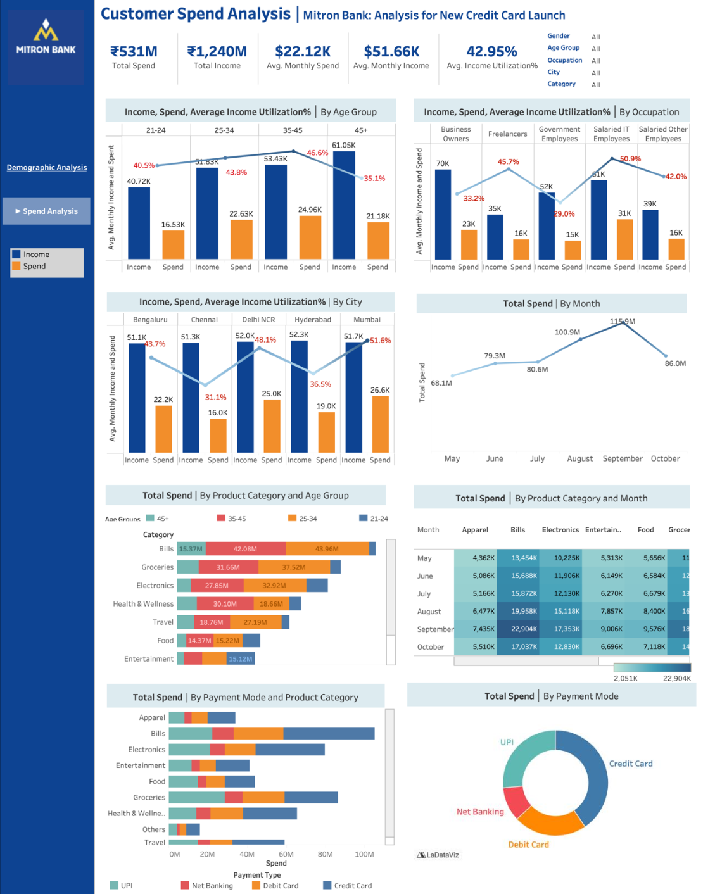

### Average Income Utilization

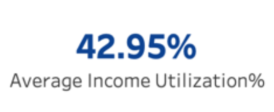

* Average Income Utilization (AIU) is calculated as avg_monthly_spends / avg_monthly_income. The higher the average income utilization %, the higher the likelihood of credit card usage.
* Our analysis shows that, on average, customers allocate 42.95% of their monthly income to expenditures.

### Key Metrics: 

* Average Monthly Income over 6 months: 51.66K
* Average Monthly Spend over 6 months: 22.12K

### Average Income, Spend, Utilization by Age Group

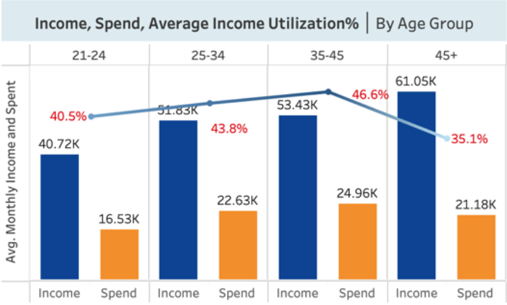

* The 35–45 age group shows the highest average income utilization rate (46.6%). 
* The second-highest is the 25–34 age group, with a utilization rate of 43.8%. 
* On average, people spend less after age 45, even as their average monthly income rises. 

### Average Income, Spend, Utilization by Occupations
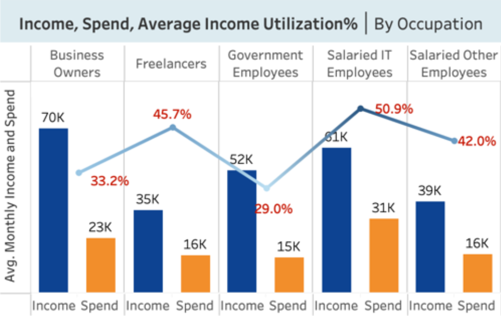

* Salaried IT employees have the highest average income utilization rate (50.9%), followed by freelancers (45.7%). 
* Although freelancers have a notably high AIU, they have a relatively low average monthly income. On the other hand, business owners have a relatively lower AIU but earn the highest average monthly income, representing significant untapped market potential. 

### Average Income, Spend, Utilization by City 

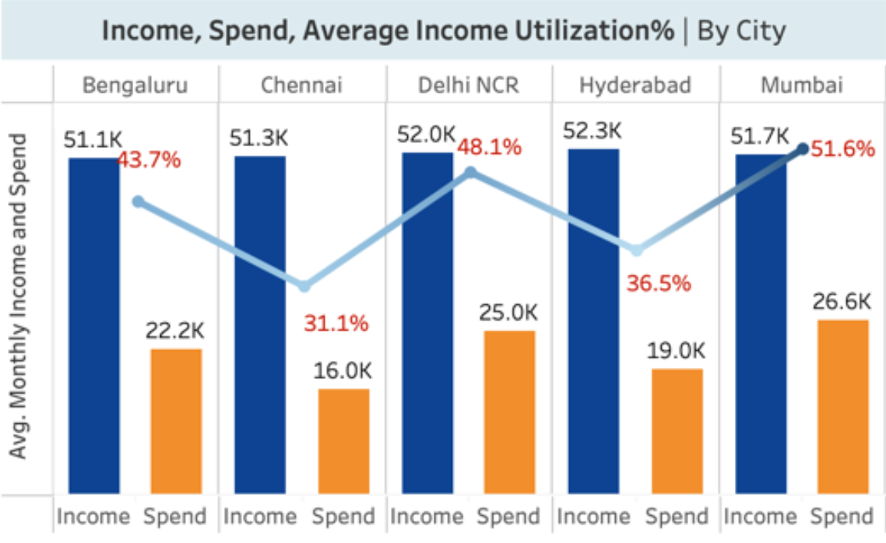

* The average monthly income differences among these cities are minimal (about 1K), with Delhi NCR and Hyderabad having slightly higher income compared to other cities.
* Mumbai stands out among other cities with the highest AIU (51.6%), followed by Delhi NCR (48.1%). Customers in these two cities spend nearly half of their income, indicating stronger consumption behavior. 
* The high AIU in Mumbai and Delhi NCR may be due to higher living costs and greater lifestyle spending compared to other cities, suggesting higher potential for credit card usage relative to the stronger saving behavior seen elsewhere. 

💼 Higher AIU is driven by higher spending, not higher income. 

### Total Spend by Month

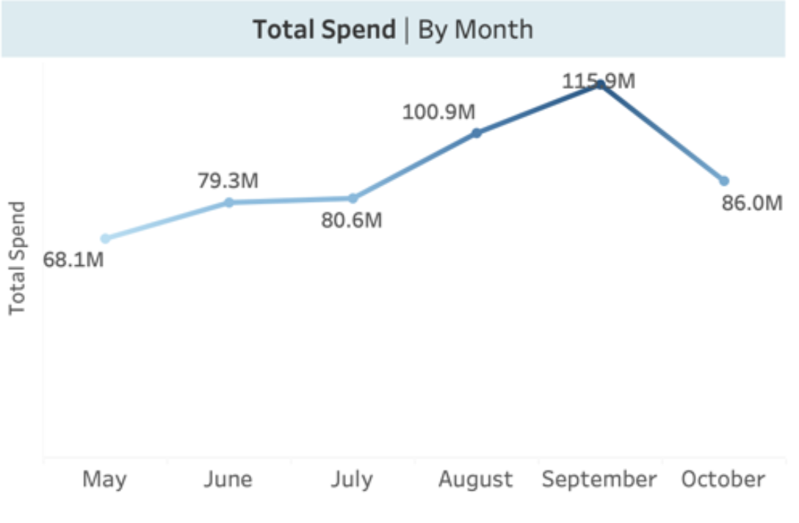

* Total spend gradually rises from May to September, reaching a peak in September at $115.9M, which constitutes 21.84% of total spend. It then drops back to $86M in October. 

Taking a closer look at total spend by product category for each month: 

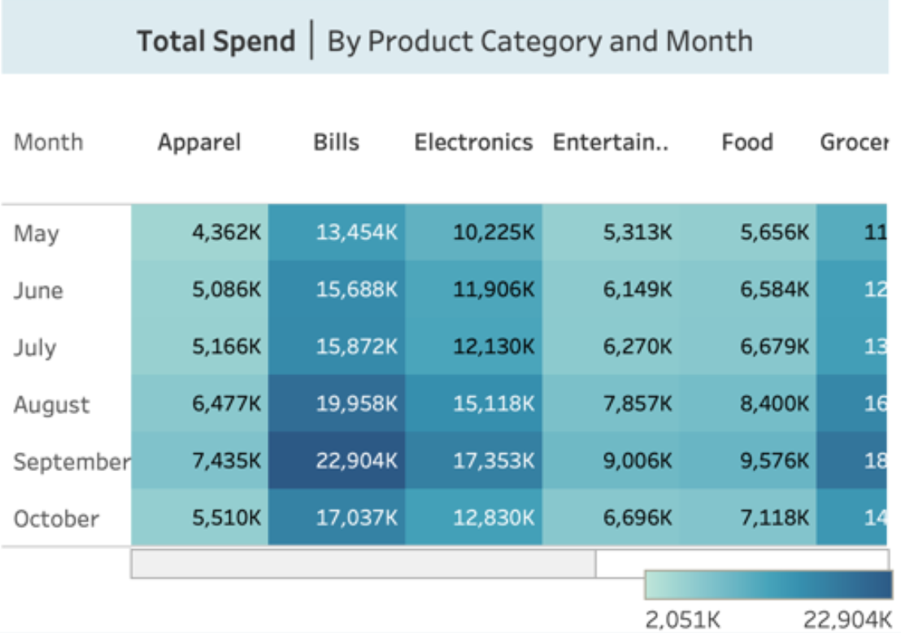

* Customers spend more on bills, electronics, groceries, and travel in August and September. This may be because August–September is the peak monsoon season in many Indian cities, where people tend to stay indoors more, leading to higher utility bills. 

* Additionally, ahead of major festivals, people may start preparing their homes and increasing usage of various services. 

💼 These seasonal spikes suggest opportunities for targeted promotions (bills, electronics, groceries, and travel) during August–September. 

### Total Spend by Product Category and Age Group 

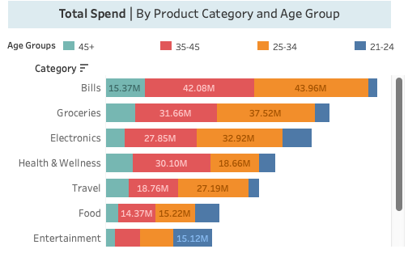

* Bills account for the highest spending among all categories ($104.92M), constituting 19.8% of total spending. 
* Despite an imbalanced age group distribution, the 21–24 age group spends the most on entertainment, electronics, and apparel. People in the 25–34 age group are building families, which is why bills and groceries become the highest spending categories. In the 35–45 age group, people begin investing more in health and wellness. Bills, groceries, and health & travel remain the primary spending categories for the 45+ group. 

### Total Spend by Payment Mode and Product Category

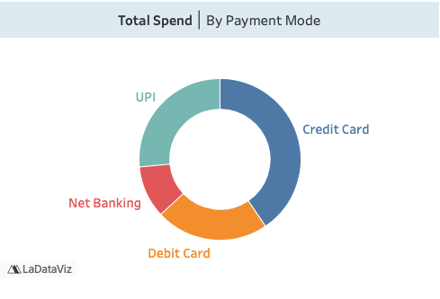
* The majority of transactions are made through credit cards, which account for 40.7% of total spend, followed by cash (26.5%) and debit cards (22.5%), likely due to benefits like rewards, EMI options, and deferred payments.

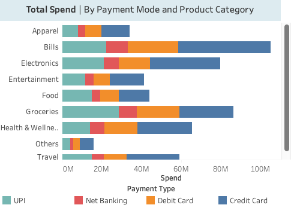
* Credit cards are the preferred payment method for high-value or recurring expenses, such as bills, electronics, health and wellness, and travel. 
* UPI is primarily used for frequent, lower-to-mid-value transactions, especially daily essentials such as groceries and food.. 

## ⭐️ Key Findings

1. Demographic profiling: 

***Gender insights***

Males are the dominant customer segment, with higher total income and spend compared to females. They have a higher AIU (44.73%) than their female counterparts (39.64%), indicating they are the primary target segment for the new credit card offerings. 

***Age insights***

The 25–34 and 35–45 age groups are the most significant segments, demonstrating high income utilization rates of 43.8% and 46.6%, respectively. 

Although the 25–34 age group has a slightly lower AIU than the 35–45 group, they are the most active credit card users, with 46.6% of their transactions paid through credit cards.  

***Occupation insights***

Salaried IT employees, freelancers, and salaried other employees are potential high-value users with AIU rates of 50.9%, 45.7%, and 42.0%, respectively. Notably, only 41% of salaried IT employees' transactions are made via credit card. Given this segment's high income and AIU, there is significant potential to attract more credit card users from this group. 

Although freelancers have a relatively high AIU, credit cards are not their preferred payment method — only 34.4% of their transactions are made through credit card. Salaried other employees are also strong candidates for new credit cards: they have a higher AIU and a willingness to pay by credit card, with 42.4% of their transactions from credit card. Based on their mid-level average monthly income, new account rewards could be particularly attractive to them.  

2. City-wise consideration: 

***Mumbai and Delhi NCR*** are the most promising markets for credit card expansion, with the highest AIU (51.6% and 48.1%, respectively) and a strong preference for credit card payments. No significant difference in preferred payment method was found across cities — approximately 40% of transactions are made via credit card in all cities. 

We can tailor features to align with the spending patterns of customers in specific cities to capture high-value users. 

## 📌 Recommendation for next credit card

### Personalized Rewards: 
* Offer cashback and points for every transaction, encouraging users to use the credit card for all expenses. 
* Provide higher credit limits to accommodate the spending patterns and financial capacity of target users. 
* Design tiered rewards programs to incentivize higher spending and reward loyal customers.

### Category-Centric Reward Boost: 
* Build strategic partnerships with renowned brands to offer cardholders exclusive discounts and early access to sales. Partner with utility companies to offer exclusive discounts or cashback for bill payments made with the credit card. 
* Increase seasonal rewards and benefits during August–September to encourage purchases made with the credit card. 
* Extend the warranty on electronic purchases made with the credit card and offer purchase protection. 

### Tech-Driven Convenience: 
Features targeted at salaried IT employees and salaried other employees: 
* Introduce specific rewards aligned with IT professionals' spending patterns, such as technology purchases, software subscriptions, and online services (e.g., Claude, ChatGPT subscriptions). 
* Introduce travel-related perks like airport lounge access, travel insurance, and discounts on flights and hotel bookings.
* Provide an extended interest-free grace period, particularly for business-related expenses and startups, giving users more time to settle payments.

### Improved Credit Card Usability:
* Link credit card purchases with UPI for quick and convenient transactions, enabling widespread usage. 
* Implement a swift and efficient approval process for credit card applications to encourage adoption without unnecessary delays.

---------------------
Created by Yawen Cao

Date: 03/17/2026

Base: Austin, TX

